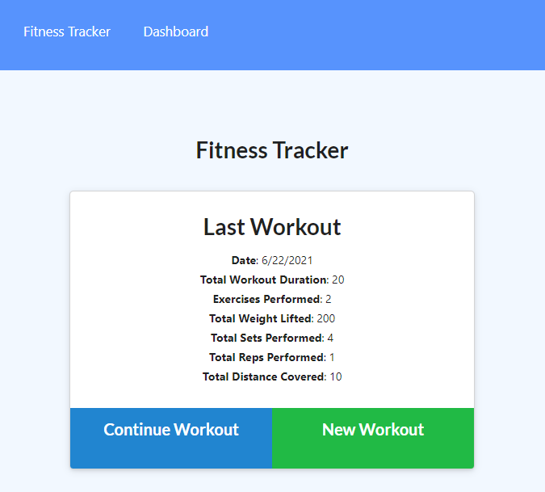
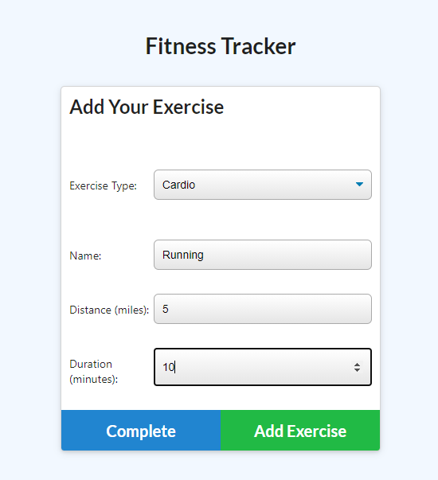
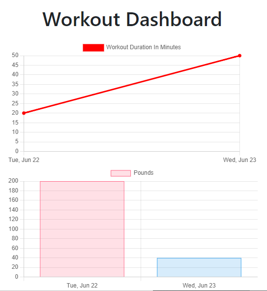

# Workout Tracker


## Table of Contents
- [Project Overview](#project-overview) 
- [Live Application](#live-application)
- [Installation](#installation)
- [License](#license)
- [Screenshots](#screenshots)

## Project Overview
Full stack application for tracking workouts by day. Each workout is assigned individual exercises by the user, which are then compiled to show total workout duration and total pounds lifted for each day a workout is logged. The application is built using HTML, CSS, and JavaScript for the client side. On the backend, the application uses Express for the server, Mongoose for the ODM, and MongoDB for the database.

[View the live application](https://workout.stephentechblog.com/) in Heroku.

### Languages Used
- JavaScript
- MongoDB
- HTML
- CSS

### Node Libraries Used
- [Mongoose](https://www.npmjs.com/package/mongoose)
- [Express](https://www.npmjs.com/package/express)
- [Compression](https://www.npmjs.com/package/compression)

See [package.json](./package.json) for full list of dependencies.

### Additional Libraries
- [Semantic UI](https://semantic-ui.com/)

## Live Application
[View application deployment](https://workout.stephentechblog.com/) in Heroku.

## Installation
To run this application on your local machine, Node.js is _required_. Once cloned/downloaded from GitHub, enter ```npm i``` in command line to install the packages referenced under Libraries Used automatically. 

Then, create the Mongo database by running the command ```use workoutdb```` in your MongoDB CLI. Next, seed the data by entering ```npm run seed``` in command line to add test data to the database. You should now be ready to launch the application by entering ```npm start```.

## License
Permission is hereby granted, free of charge, to any person obtaining a copy of this Software and associated documentation files (the "Software"), to deal in the Software without  restriction, including without limitation the rights to use, copy, modify, merge, publish distribute, sublicense, and/or sell copies of the Software, and to permit persons to whom the Software is furnished to do so, subject to the following conditions.

[View the full license](./LICENSE)

## Screenshots





